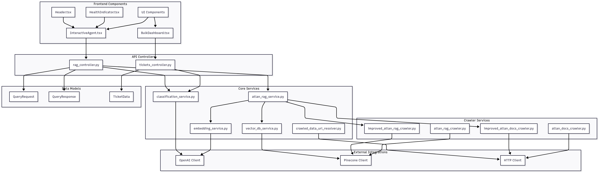
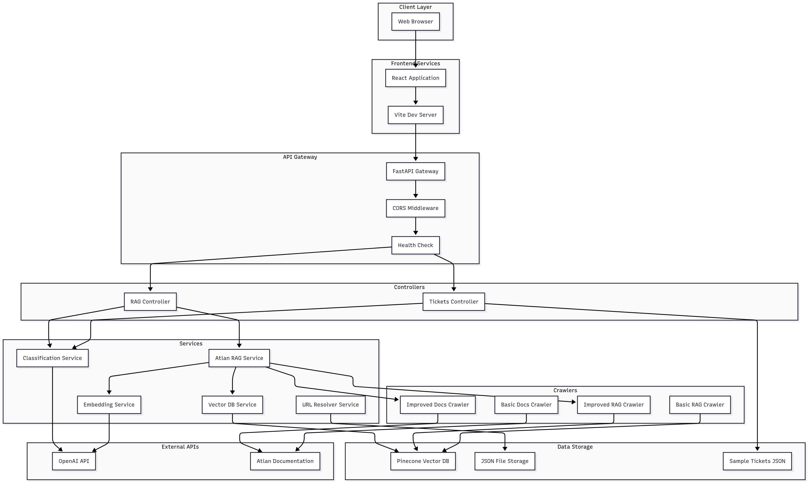
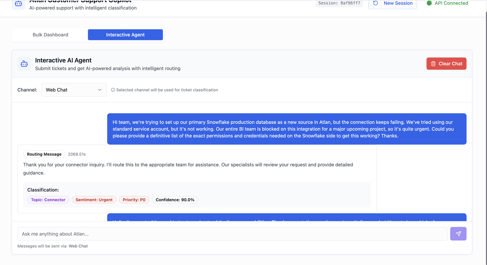
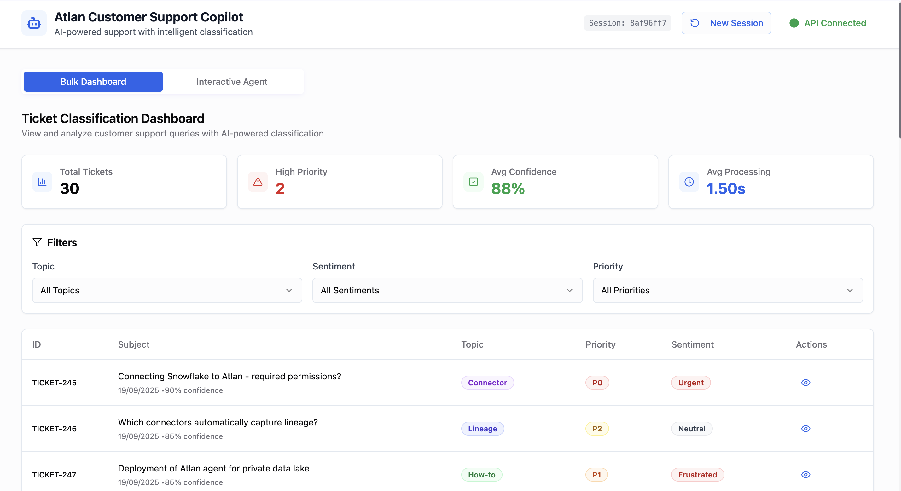
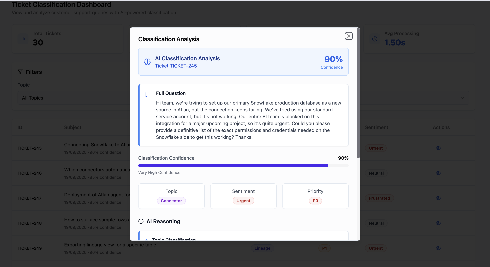
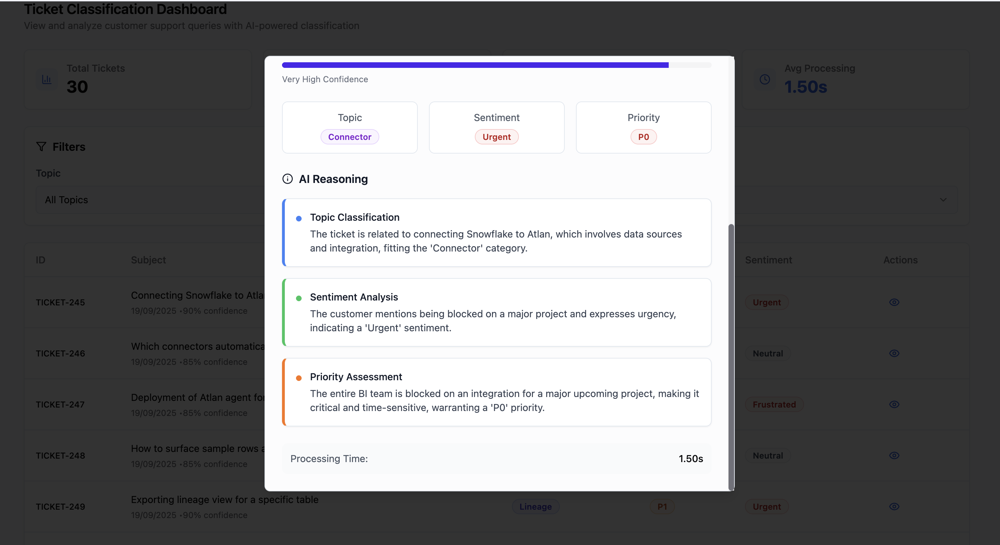

# 🚀 Atlan Customer Support Copilot

An intelligent AI-powered customer support system that provides automated assistance for Atlan-related queries with advanced classification, RAG (Retrieval Augmented Generation), and multi-channel support.

## 📋 Table of Contents

- [Features](#-features)
- [Architecture](#-architecture)
- [Screenshots](#-screenshots)
- [Technology Stack](#-technology-stack)
- [Project Structure](#-project-structure)
- [Installation & Setup](#-installation--setup)
- [Environment Variables](#-environment-variables)
- [API Documentation](#-api-documentation)
- [Testing](#-testing)
- [Deployment](#-deployment)
- [Scalability & Multi-Channel Integration](#-scalability--multi-channel-integration)
- [Contributing](#-contributing)
- [License](#-license)

## ✨ Features

### 🤖 AI-Powered Assistant
- **Intelligent Query Classification**: Automatically categorizes queries into topics (API/SDK, Connector, SSO, How-to, Product, Best practices, Lineage, Glossary, Sensitive data, General)
- **Sentiment Analysis**: Detects user sentiment (Urgent, Frustrated, Positive, Curious, Neutral)
- **Priority Assessment**: Assigns priority levels (P0, P1, P2, P3) based on query content and sentiment
- **RAG Integration**: Retrieval Augmented Generation for accurate, context-aware responses
- **Intelligent URL Resolution**: Smart citation system that provides relevant documentation links

### 📊 Classification Dashboard
- **Real-time Analytics**: Live statistics on query volume, response times, and classification accuracy
- **Advanced Filtering**: Filter tickets by topic, sentiment, priority, and date range
- **Detailed Insights**: View classification reasoning and confidence scores
- **Export Functionality**: Download filtered data for analysis

### 🔄 Multi-Channel Support
- **Web Chat**: Primary interface for direct user interaction
- **WhatsApp**: Mobile messaging integration
- **Email**: Email-based support tickets
- **Voice**: Voice-to-text support
- **Slack**: Team collaboration integration
- **Microsoft Teams**: Enterprise communication platform

### 🎯 Smart Response System
- **Context-Aware Answers**: Provides relevant, accurate responses based on Atlan documentation
- **Code Snippets**: Copyable code examples with syntax highlighting
- **Follow-up Suggestions**: Intelligent follow-up questions to guide users
- **Citation System**: Links to official documentation sources

## 🏗️ Architecture

### High-Level Design (HLD)


### Low-Level Design (LLD)


### System Architecture


### Sequence Flow


## �� Screenshots

### AI Assistant Interface


### Classification Dashboard


### Classification Details


### Reasoning Display


## 🛠️ Technology Stack

### Backend
- **FastAPI**: Modern, fast web framework for building APIs
- **Python 3.12+**: Core programming language
- **OpenAI GPT-3.5-turbo**: AI classification and response generation
- **Pinecone**: Vector database for semantic search
- **Pydantic**: Data validation and serialization
- **Uvicorn**: ASGI server for production deployment

### Frontend
- **React 18**: Modern UI library with hooks
- **TypeScript**: Type-safe JavaScript development
- **Tailwind CSS**: Utility-first CSS framework
- **React Markdown**: Markdown rendering with syntax highlighting
- **React Syntax Highlighter**: Code snippet highlighting
- **Vite**: Fast build tool and development server

### Infrastructure
- **Vercel**: Frontend deployment platform
- **Render**: Backend deployment platform
- **Git**: Version control and collaboration

## 📁 Project Structure

```
agent-vue-assist/
├── backend/                    # FastAPI backend
│   ├── controllers/           # API route handlers
│   │   ├── rag_controller.py  # RAG query handling
│   │   └── tickets_controller.py # Ticket management
│   ├── services/              # Business logic
│   │   ├── atlan_rag_service.py # RAG implementation
│   │   ├── classification_service.py # AI classification
│   │   ├── crawled_data_url_resolver.py # URL resolution
│   │   ├── vector_db_service.py # Pinecone integration
│   │   └── embedding_service.py # Text embedding
│   ├── config/                # Configuration
│   │   └── settings.py        # Environment settings
│   ├── tests/                 # Backend tests
│   │   └── test_simple.py     # Unit tests
│   ├── scripts/               # Utility scripts
│   ├── app.py                 # FastAPI application
│   └── requirements.txt       # Python dependencies
├── frontend/                  # React frontend
│   ├── src/
│   │   ├── components/        # React components
│   │   │   ├── InteractiveAgent.tsx # Main chat interface
│   │   │   └── BulkDashboard.tsx # Classification dashboard
│   │   ├── lib/               # Utilities
│   │   │   └── api.ts         # API service
│   │   ├── types/             # TypeScript types
│   │   │   └── api.ts         # API type definitions
│   │   ├── __tests__/         # Frontend tests
│   │   │   └── simple.test.ts # Unit tests
│   │   └── App.tsx            # Main application
│   ├── package.json           # Node.js dependencies
│   └── vite.config.ts         # Vite configuration
├── images/                    # Architecture diagrams
│   ├── HLD.png               # High-Level Design
│   ├── LLD.png               # Low-Level Design
│   ├── SYSTEM_architecture.png # System Architecture
│   ├── sequence_diagram.png   # Sequence Flow
│   ├── AI_assistant.png      # AI Assistant Screenshot
│   ├── Dasboard.png          # Dashboard Screenshot
│   ├── Classification1.png   # Classification Screenshot
│   └── Reasoning.png         # Reasoning Screenshot
├── run_tests.sh              # Test runner script
├── README.md                 # This file
└── API_DOCUMENTATION.md      # API documentation
```

## 🚀 Installation & Setup

### Prerequisites
- Python 3.12+
- Node.js 18+
- OpenAI API key
- Pinecone API key

### Backend Setup
```bash
cd backend
python -m venv .venv
source .venv/bin/activate  # On Windows: .venv\Scripts\activate
pip install -r requirements.txt
```

### Frontend Setup
```bash
cd frontend
npm install --legacy-peer-deps
```

### Running the Application
```bash
# Terminal 1: Backend
cd backend
source .venv/bin/activate
uvicorn app:app --reload --host 0.0.0.0 --port 8000

# Terminal 2: Frontend
cd frontend
npm run dev
```

## 🔧 Environment Variables

### Backend (.env)
```env
OPENAI_API_KEY=your_openai_api_key_here
PINECONE_API_KEY=your_pinecone_api_key_here
PINECONE_ENVIRONMENT=your_pinecone_environment_here
PINECONE_TICKETS_INDEX=atlan-tickets
PINECONE_DOCS_INDEX=atlan-docs
```

### Frontend (.env)
```env
VITE_API_BASE_URL=http://localhost:8000
```

## 📚 API Documentation

### Core Endpoints

#### RAG Query
```http
POST /api/rag/query
Content-Type: application/json

{
  "query": "How do I install the Python SDK?",
  "channel": "Web Chat",
  "session_id": "user-session-123",
  "include_followup": true
}
```

#### Ticket Management
```http
GET /api/tickets/
POST /api/tickets/
GET /api/tickets/{ticket_id}
```

#### Classification
```http
POST /api/tickets/classify
Content-Type: application/json

{
  "content": "User query text",
  "subject": "Query subject"
}
```

### Response Format
```json
{
  "answer": "Detailed response with code examples",
  "citations": [
    {
      "url": "https://developer.atlan.com/sdks/python/",
      "doc": "Python SDK Documentation"
    }
  ],
  "classification": {
    "topic": "API/SDK",
    "sentiment": "Neutral",
    "priority": "P2",
    "confidence": 0.9
  },
  "classification_reasons": {
    "topic_reasoning": "SDK related query",
    "sentiment_reasoning": "Neutral tone",
    "priority_reasoning": "Standard priority"
  },
  "followup_suggestions": [
    {"question": "How do I authenticate with the SDK?"}
  ],
  "processing_time": 1.2,
  "session_id": "user-session-123",
  "response_type": "rag_response"
}
```

## 🧪 Testing

### Backend Tests (Python + pytest)
```bash
cd backend
source .venv/bin/activate
python -m pytest tests/test_simple.py -v
```

**Test Coverage:**
- ✅ Basic functionality and data structures
- ✅ Technology extraction logic (Python, Java, Kotlin, Scala, Go, JavaScript)
- ✅ URL validation and SDK detection
- ✅ Classification logic for topics, sentiment, and priority
- ✅ RAG response structure validation
- ✅ Ticket classification structure validation
- ✅ Error handling and edge cases
- ✅ Async functionality testing

### Frontend Tests (React + Vitest)
```bash
cd frontend
npm run test:run
```

**Test Coverage:**
- ✅ API request/response structure validation
- ✅ Ticket data structure validation
- ✅ Channel options validation
- ✅ Topic classification options
- ✅ Sentiment and priority options
- ✅ URL structure validation
- ✅ Confidence score validation
- ✅ Processing time validation
- ✅ Response type validation

### Run All Tests
```bash
./run_tests.sh
```

**Test Results:**
- **Backend**: 14 tests passed ✅
- **Frontend**: 11 tests passed ✅
- **Total**: 25 tests passed ✅

### Test Features
- **Unit Testing**: Core business logic validation
- **Structure Validation**: API request/response formats
- **Edge Case Testing**: Error handling and boundary conditions
- **Data Validation**: Classification and processing logic
- **Mock Testing**: External dependencies properly mocked
- **Async Testing**: Proper async/await functionality testing

## 🚀 Deployment

### Frontend (Vercel)
1. Connect your GitHub repository to Vercel
2. Set environment variables in Vercel dashboard
3. Deploy automatically on push to main branch

### Backend (Render)
1. Connect your GitHub repository to Render
2. Set environment variables in Render dashboard
3. Deploy automatically on push to main branch

### Environment Variables for Production
```env
# Backend
OPENAI_API_KEY=your_production_openai_key
PINECONE_API_KEY=your_production_pinecone_key
PINECONE_ENVIRONMENT=your_production_environment

# Frontend
VITE_API_BASE_URL=https://your-backend-url.onrender.com
```

## 📈 Scalability & Multi-Channel Integration

### Scalability Features
- **Microservices Architecture**: Modular design for easy scaling
- **Vector Database**: Pinecone for efficient semantic search
- **Async Processing**: Non-blocking operations for better performance
- **Caching Strategy**: Intelligent caching for frequently asked questions
- **Load Balancing**: Ready for horizontal scaling

### Multi-Channel API Integration
The system is designed to integrate with multiple communication channels through APIs:

#### Web Chat Integration
```javascript
// Direct API integration
const response = await fetch('/api/rag/query', {
  method: 'POST',
  headers: { 'Content-Type': 'application/json' },
  body: JSON.stringify({
    query: userMessage,
    channel: 'Web Chat',
    session_id: sessionId
  })
});
```

#### WhatsApp Integration
```javascript
// WhatsApp Business API integration
const whatsappResponse = await fetch('/api/rag/query', {
  method: 'POST',
  headers: { 'Content-Type': 'application/json' },
  body: JSON.stringify({
    query: whatsappMessage,
    channel: 'WhatsApp',
    session_id: whatsappSessionId
  })
});
```

#### Slack Integration
```javascript
// Slack Bot API integration
const slackResponse = await fetch('/api/rag/query', {
  method: 'POST',
  headers: { 'Content-Type': 'application/json' },
  body: JSON.stringify({
    query: slackMessage,
    channel: 'Slack',
    session_id: slackChannelId
  })
});
```

#### Email Integration
```javascript
// Email processing integration
const emailResponse = await fetch('/api/rag/query', {
  method: 'POST',
  headers: { 'Content-Type': 'application/json' },
  body: JSON.stringify({
    query: emailContent,
    channel: 'Email',
    session_id: emailThreadId
  })
});
```

### Channel-Specific Features
- **Session Management**: Persistent sessions across channels
- **Context Preservation**: Maintains conversation context
- **Channel-Specific Formatting**: Optimized responses for each channel
- **Rate Limiting**: Channel-specific rate limiting
- **Analytics**: Channel-specific usage analytics

## 🤝 Contributing

1. Fork the repository
2. Create a feature branch (`git checkout -b feature/amazing-feature`)
3. Commit your changes (`git commit -m 'Add some amazing feature'`)
4. Push to the branch (`git push origin feature/amazing-feature`)
5. Open a Pull Request

## 📄 License

This project is licensed under the MIT License - see the [LICENSE](LICENSE) file for details.

## 🙏 Acknowledgments

- **Atlan**: For providing comprehensive documentation
- **OpenAI**: For powerful AI capabilities
- **Pinecone**: For vector database services
- **FastAPI**: For the excellent web framework
- **React**: For the modern UI library

---

**Built with ❤️ for the Atlan Customer Support Team**
